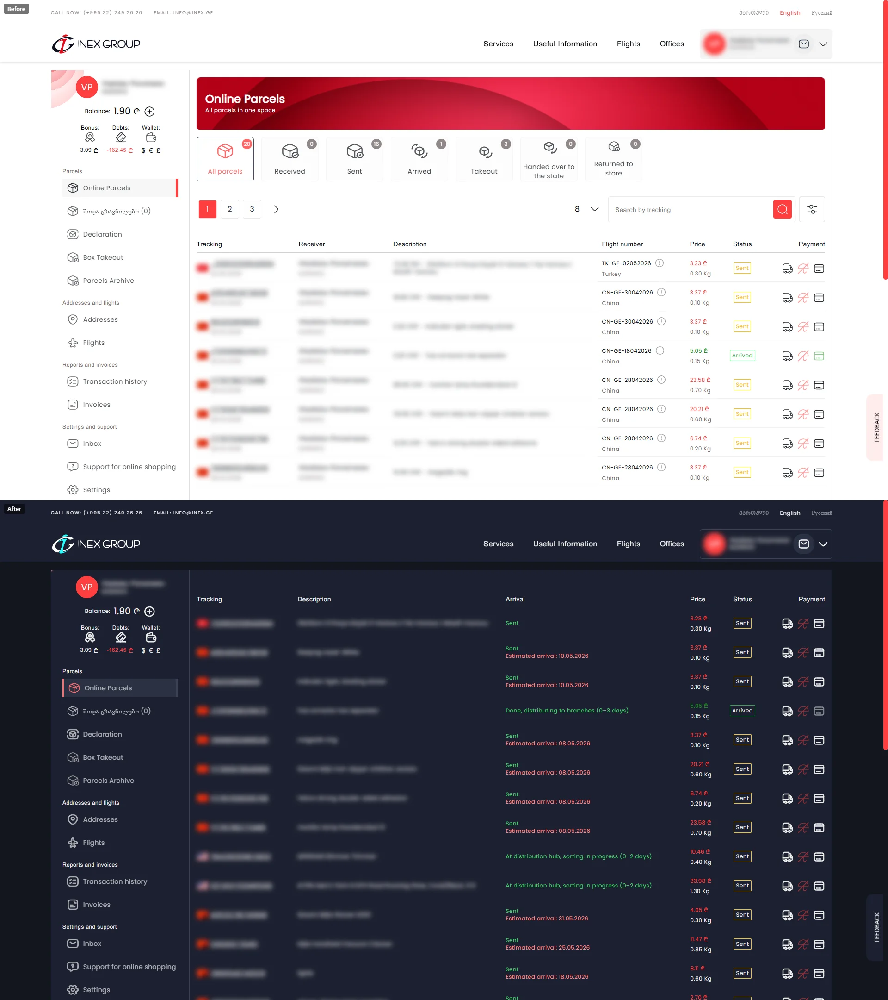

# inex.ge tweaks

Userscript that makes the [inex.ge](https://inex.ge) parcel tracking page faster to scan and easier on the eyes.

## What it does

- **Dark theme** across the whole site — readable surfaces, no white panels, no black icons.
- **Bigger parcel list by default** — forces `?perPage=20` on first visit; never overrides if you change it.
- **Replaces the Flight Number column** with the latest status in green and estimated arrival date in red. Original tooltip preserved — hover anywhere on the cell to see full history.
- **Translates Georgian statuses** to English (e.g. "გამოგზავნილია" → "Sent").
- **Sort by arrival date** — click the "Arrival" header. Soonest action first: arrived parcels on top, then by ETA, sent-without-ETA next, takeout/done at the bottom. Disabled when there are multiple pages so you don't get a half-sorted list.
- **Expanded tracking numbers** — no more `...XXXXX` truncation.
- **Cleaner description** — drops the `12.34 CNY -` price prefix in front of every item name.
- **Removes site clutter** — page title banner, status filter buttons, top search bar, send-date in the tracking column.
- **Hides the Recipient column** — you already know it's you.
- **Hides Takeout parcels** from the list (still visible in the dedicated Takeout view).

Every feature has a toggle in the userscript manager menu. All on by default.

## Install

1. Install [Violentmonkey](https://violentmonkey.github.io/) or [Tampermonkey](https://www.tampermonkey.net/) for your browser.
2. [Click here to install](https://raw.githubusercontent.com/Mayurifag/inex-ge-userscript/release/inex-ge.user.js).
3. Confirm in the userscript manager prompt.

Updates are pulled automatically.

### Dark theme only (no JS)

If you only want the dark theme colors and none of the other tweaks, install [Stylus](https://chromewebstore.google.com/detail/stylus/clngdbkpkpeebahjckkjfobafhncgmne) and then [click here to install the userstyle](https://raw.githubusercontent.com/Mayurifag/inex-ge-userscript/master/src/dark.user.css) — Stylus detects the `.user.css` extension and prompts to install. Toggle it on/off through Stylus.

## Toggle features

Open your userscript manager menu while on inex.ge — each feature shows as `[on] Feature name` / `[off] Feature name`. Click to flip.
